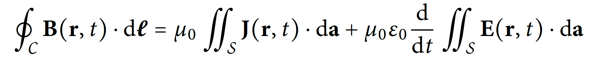

# A LaTeX Document Class for Typesetting Experimental Physics Reports

This LaTeX document class, `epreport.cls` is aimed at (under)graduate physics students who are taking experimental physics classes and need accurate, powerful typesetting of physics reports.

In this document, several package names are formatted as such: [`lipsum`](http://mirrors.ctan.org/macros/latex/contrib/lipsum/lipsum.pdf).
As most hyperlinks, these links are *blue*, because they are hyperlinks. They are clickable and should lead you to the package documentation as a PDF, hosted on CTAN (the **C**omprehensive **T**eX **A**rchive **N**etwork).

- [Intermediate Typesetting](#intermediate-typesetting)
- [Software](#software)
- [Mathematical and Scientific Typesetting](#mathematical-and-scientific-typesetting)
	- [Multivariable and Vector Calculus](#multivariable-and-vector-calculus)
	- [Numbers, Ranges, Units, and Uncertainties](#numbers-ranges-units-and-uncertainties)
		- [Numbers and Ranges](#numbers-and-ranges)
		- [Units](#units)
- [Figures, Graphs, Images, and Tables](#figures-graphs-images-and-tables)
- [Implementation](#implementation)
	- [Packages Imported](#packages-imported)
		- [Fonts and](#fonts-and)

## Intermediate Typesetting

A complete, from-scratch LaTeX tutorial is quite out of the scope of this document. Instead, there exist better materials for the absolute LaTeX novice:

* [Overleaf: Learn LaTeX in 30 Minutes](https://www.overleaf.com/learn/latex/Learn_LaTeX_in_30_minutes)
* [`lshort`, or *The Not So Short
Introduction to LATEX 2ε*](https://download.nus.edu.sg/mirror/ctan/info/lshort/english/lshort.pdf)

A quick Google search should turn up far more documents, videos, and other resources. Instead, this guide is aimed at users who already have *some* experience typesetting with LaTeX, and who wish to improve the quality of their report output, or to reduce the workload needed in typesetting high-quality reports, by providing some starter documentation (what you are reading now), as well as a list of pre-imported packages.

## Software

Many occasional users of LaTeX choose Overleaf to typeset their documents.
Overleaf is admittedly handy for the novice user, but for any measure of speed improvement, a local TeX distribution and a powerful text editor is almost mandatory.
Even so, many users tend to use dedicated 'TeX IDEs' like TeXStudio or TeXMaker, rather than general-purpose text editors.

As a couple of steps up, I suggest using [Visual Studio Code](https://code.visualstudio.com/) (VS Code in short) with the [LaTeX Workshop](https://marketplace.visualstudio.com/items?itemName=James-Yu.latex-workshop) extension.
Notwithstanding the neat integration with VS Code, it is also noticeably faster when compiling than TeXStudio, as well as already providing a built-in method (specifically, `latexmk`) for automatic re-compiling.
Furthermore, VS Code provides some extremely handy Vim-esque shortcuts that expand to environments, maths code, or other complex macros: this can add up to a very large amount of time saved when typesetting complex formulae.

A full list of the snippets is [here](https://github.com/James-Yu/LaTeX-Workshop/wiki/Snippets); some examples are provided below.

| Snippet typed                                                           | Tab-expansion                        | Remarks                                                                                                                   |
| ----------------------------------------------------------------------- | ------------------------------------ | ------------------------------------------------------------------------------------------------------------------------- |
| `@a`                                                                    | `\alpha`                             | Greek alphabet: use the first letter.                                                                                     |
| `@D`                                                                    | `\Delta`                             | Capital Greek alphabet: capitalise.                                                                                       |
| `@vs`                                                                   | `\varsigma`                          | V for var.                                                                                                                |
| `@/`, `@%`                                                              | `\frac{}{}`                          | Two placeholders that can be navigated forward with <kbd>Tab</kbd>,  and backward with <kbd>Shift</kbd> + <kbd>Tab</kbd>. |
| `@I`                                                                    | `\int_{}^{}`                         | Integral. Again with navigable placeholders, as above.                                                                    |
| `@8`                                                                    | `\infty`                             | Infinity symbol: looks like an '8' on its side.                                                                           |
| `@F`                                                                    | `\Phi`                               | Phi is pronounced 'Fye', hence F.                                                                                         |
| `BEQ`                                                                   | `\begin{equation}  \end{equation}`   | **B**egin **Eq**uation.                                                                                                   |
| `BEN`                                                                   | `\begin{enumerate}  \end{enumerate}` | Same as above.                                                                                                            |
| `SSE`                                                                   | `\section{}`                         | Start Section                                                                                                             |
| `FBF`                                                                   | `\textbf{}`                          | Font BF. Cursor is set to be within the braces.                                                                           |
| <kbd>Ctrl</kbd> + <kbd>L</kbd>, then <kbd>Ctrl</kbd> + <kbd>Enter</kbd> | Newline, and then `\item`.           | Useful for lists and enumerated lists.                                                                                    |

Users who are further still familiar with the command line may choose `vim` or `emacs` with the VimTeX, or AUCTeX extensions respectively.

## Mathematical and Scientific Typesetting

Of course, the primary reason for this document class was to reduce the workload of the typesetter; therefore, it includes a variety of appropriate LaTeX packages for scientific typesetting.
As mentioned above, a full list may be found at the end of this read-me.

A few key examples are listed below.

### Multivariable and Vector Calculus

`epreport.cls` imports the powerful [`physics`](http://mirrors.ctan.org/macros/latex/contrib/physics/physics.pdf) package, which provides *dozens* of convenient macros for physics typesetting, from (partial, complete) differentials, bold-roman vectors and matrices, Dirac bra-ket notation, and matrix shortcuts, as well as macros to avoid excessive `\left` and `\right` strings in your source code.
There is little point in merely repeating the documentation (hyperlinked above) here, as it is relatively short and concise.
That said, a quick example will serve to demonstrate the sheer simplicity and readability of the source code for a (fairly) complicated expression:

```LaTeX
\oint_\mathcal{C} \vb{B}(\vb{r}, t)\cdot \dd{\vb*{\ell}} &= \mu_0\iint_\mathcal{S} \vb{J}(\vb{r}, t) \cdot \dd{\vb{a}} + \mu_0\varepsilon_0 \dv{t} \iint_\mathcal{S}\vb{E}(\vb{r}, t)\cdot \dd{\vb{a}}
```



Notice the use of `\vb`—'**v**ector **b**old', `\dd`—total derivatives, and `\dv{<argument>}`, which is equivalent to `\frac{\mathrm{d}}{<argument>}`.
The physics convention is to typeset the `d` in `dx` as roman, rather than *italic*, which is the behaviour that `physics` provides.
Do note that `\vec` does *not* produce the required results for bold roman vectors.
As mentioned above, the documentation is found in the hyperlink above, which is reproduced [here](http://mirrors.ctan.org/macros/latex/contrib/physics/physics.pdf).

Furthermore, `epreport.cls` includes [`esint`](http://mirrors.ctan.org/macros/latex/contrib/esint/esint-doc.pdf), which simplifies multiple integrals and more. Some examples follow:


This image was lifted *verbatim* from the package documentation, as hyperlinked above.

### Numbers, Ranges, Units, and Uncertainties

Perhaps the most famous LaTeX package is [`siunitx`](http://mirrors.ctan.org/macros/latex/contrib/siunitx/siunitx.pdf), and for good reason. No more italic units, nor manually specifying `\mathrm{kg}`, for instance. `siunitx` is immensely feature-packed, and it would defeat the purpose of listing *everything* it provides here. As always, a few key examples are used to illustrate its potency.

#### Numbers and Ranges

`siunitx` typesets numbers and scientific notation with extreme ease. The following table lists a few examples:


#### Units

To typeset a physical quantity with attached units, say 'thirty five kilograms per metre per second squared', one could do: `\SI{35}{\kg\per\m\per\s\squared}`. 
Nearly every single unit is supported (even US customary, in spite of the package name). 
The key takeaway: two *capital* letters, and two braces. 
Note that most units require their *full* names; for instance, to typeset '25 mA s = 25 C', one would need to type: `\SI{25}{\mega\ampere\second} = \SI{25}{\coulomb}`. 
This is another reason why VS Code was recommended: the commands defined by the packages imported can automatically be proposed with <kbd>Tab</kbd>-autocomplete, without b


## Figures, Graphs, Images, and Tables

## Implementation

`epreport.cls` was built on the already-existing `article.cls`, as nearly all other LaTeX documents are. A large list of packages are used to improve the quality of life while typesetting.
A complete list is reproduced below, along with links to the packages' documentation.

### Packages Imported

#### Fonts and
